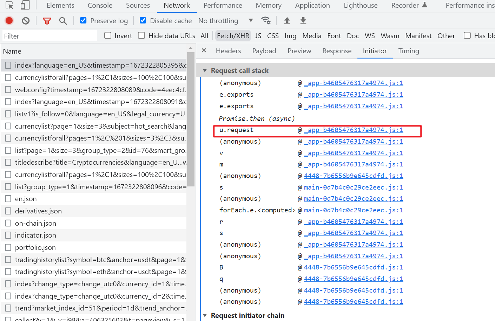

# MyToken

目标网址：

```
https://www.mytokencap.com/
```

请求的参数上都带着一个`code`：


观察请求的Initiator：



像这种请求的Initiator中有个.request的一看就是axios发送的请求，它在request中会调用设置的请求拦截器响应拦截器，直接跟进去request然后打断点触发：


可以看到设置了一个请求拦截器，跟进去它的代码：


主要是下面几行：

```js
, n = Date.now().toString()
    , r = o()(n + "9527" + n.substr(0, 6));
if (e.data.timestamp = n,
    e.data.code = r,
```

`n`就是获取当前时间，然后`o()`的整个输入都是从n得到的，没啥好看的就，当然这个时间戳通过`e.data.timestamp`传给了服务器，因为服务器要做校验的需要输入相同，然后再来看`o()`是啥，跟进去目测是MD5，验证一下：


分析结束。


